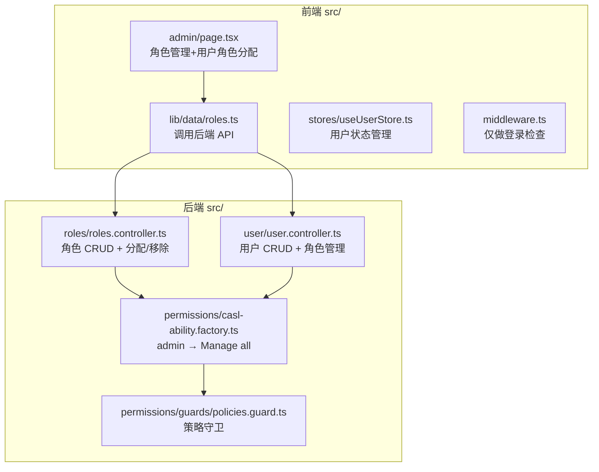
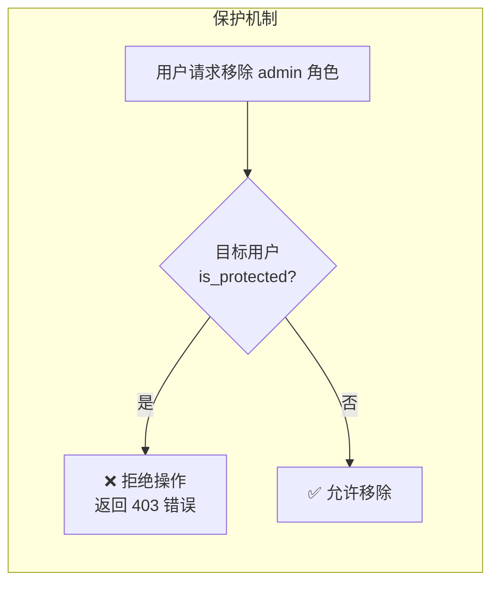
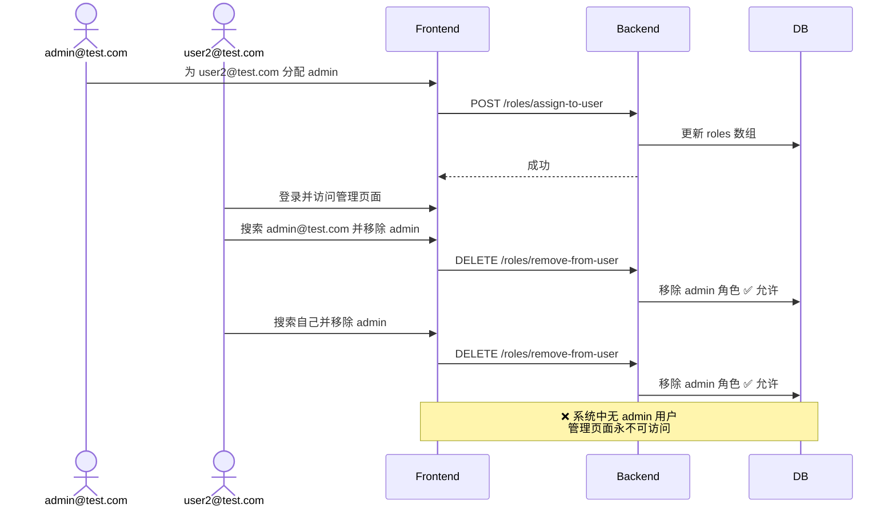
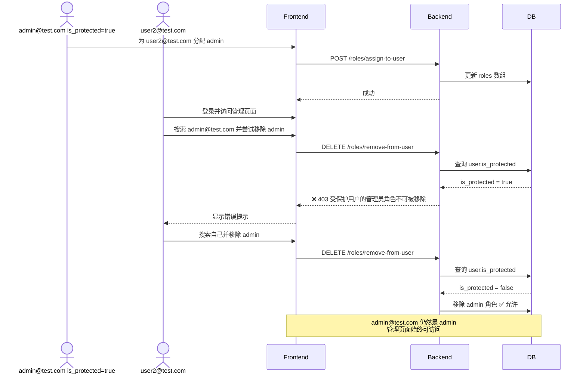

# 角色权限管理安全问题分析与修复计划

## 一、问题综述

通过全面审查前后端代码，发现当前基于角色的权限管理系统存在多个严重安全问题，可能导致 **"权限锁定"（Permission Lockout）**——即系统中最后一个拥有 `admin` 角色的用户被移除 admin 角色，导致无人能再访问管理页面。

---

## 二、架构概览



---

## 三、发现的严重问题

### 问题 1：后端无"最后管理员"保护（Critical）

后端 [`roles.service.ts`](backend/src/roles/roles.service.ts:183) 的 `removeRoleFromUserByEmail` 方法没有任何检查，允许任意管理员移除任意用户的任意角色（包括 admin 角色）。

**影响路径：**
1. `admin@test.com` 将 admin 角色分配给 `user2@test.com`
2. `user2@test.com` 登录，访问 `/admin` 页面
3. `user2@test.com` 搜索 `admin@test.com` 并移除其 admin 角色
4. `user2@test.com` 再搜索自己并移除自己的 admin 角色
5. **系统中无任何用户拥有 admin 角色 → 管理页面永久不可访问**

### 问题 2：后端无"自移除"保护（Critical）

[`roles.service.ts`](backend/src/roles/roles.service.ts:183) 和 [`user.service.ts`](backend/src/user/user.service.ts:93) 的移除角色方法均未检查**操作者是否正在移除自己的 admin 角色**。

### 问题 3：前端无安全防护措施（High）

[`admin/page.tsx`](frontend/src/app/[locale]/(main)/admin/page.tsx) 中的 `handleRemove` 函数：

- **未阻止**当前管理员移除自己的 admin 角色
- **未阻止**移除**最后一个** admin 用户
- **未区分** admin 角色和其他角色的移除逻辑
- 前端 `isAdmin()` 函数只做简单的角色包含检查，无额外保护

### 问题 4：CASL 能力工厂权限粒度过粗（Medium）

[`casl-ability.factory.ts`](backend/src/permissions/casl-ability.factory.ts:16) 中：

```typescript
if (user.roles.includes('admin')) {
  can(Action.Manage, 'all');  // admin 可以管理一切
}
```

`Manage 'all'` 意味着 admin 可对任何 subject 执行任何操作，无法区分"管理用户角色"和"管理自己的 admin 角色"。

### 问题 5：前端路由保护仅检查登录状态（Medium）

[`middleware.ts`](frontend/src/middleware.ts:35) 对 `/admin` 路径只检查是否登录，未检查是否具有 admin 角色。虽然前端页面组件内部会二次检查 [`isAdmin(user)`](frontend/src/app/[locale]/(main)/admin/page.tsx:41)，但中间件层面缺少防护。

### 问题 6：前端将 admin 角色硬编码为"系统保护"但无实际约束（Low）

[`admin/page.tsx`](frontend/src/app/[locale]/(main)/admin/page.tsx:276) 中，admin 角色卡片显示"系统保护"徽章且不可删除，**但这仅阻止角色本身的删除**，不阻止从用户身上移除 admin 角色。

---

## 四、修复策略

### 核心方案：引入"受保护用户"（Protected User）机制

在 [`User` 实体](backend/src/entities/user.entity.ts) 中增加 `is_protected` 字段，标记某些用户为"不可降级"用户：

- 受保护用户的 admin 角色**不允许被移除**
- 受保护用户自身也不允许被删除
- 通过初始化脚本（`init-db.sql`）将初始 admin 用户（`admin@test.com`）标记为受保护
- 后续只能通过直接数据库操作来修改



**为什么选择这个方案而不是"最后 admin 计数"？**

| 维度 | 最后管理员计数 | 超级管理员标记 ✅ |
|------|--------------|-----------------|
| 并发安全 | ⚠️ 竞态风险 | ✅ 天然安全 |
| 逻辑复杂度 | 中等 | 简单 |
| 可预测性 | 边界情况多 | 清晰明确 |
| 额外好处 | 仅防锁死 | 防锁死 + 防误操作 |

---

## 五、实施步骤

### Step 1：后端 — User 实体增加 `is_protected` 字段

**涉及文件：** [`user.entity.ts`](backend/src/entities/user.entity.ts)

**改动内容：**
- 新增 `@Column({ default: false }) is_protected: boolean;` 字段
- 这是一个简单的布尔标记，默认为 false

### Step 2：后端 — 更新初始化脚本

**涉及文件：** [`init-db.sql`](backend/docker/init-db.sql)

**改动内容：**
- 在插入种子用户数据时，为 `admin@test.com` 设置 `is_protected = true`
- 添加注释说明该字段的用途

### Step 3：后端 — 在角色移除逻辑中增加保护检查

**涉及文件：** [`roles.service.ts`](backend/src/roles/roles.service.ts) `removeRoleFromUserByEmail` 方法

**改动内容：**
- 在移除角色前，检查目标用户的 `is_protected` 属性
- 如果 `is_protected === true` 且要移除的角色是 `admin`：
  - 抛出 `ForbiddenException('受保护用户的管理员角色不可被移除')`
- 如果 `is_protected === true` 且要移除的角色是其他角色：允许
- 注意：受保护用户移除**非 admin** 角色不受限制

### Step 4：后端 — 在 UserService 中增加保护检查

**涉及文件：** [`user.service.ts`](backend/src/user/user.service.ts) `removeRoleFromUser` 方法和 `updateUserRoles` 方法

**改动内容：**
- 同样的保护逻辑：如果用户是受保护用户，阻止移除其 admin 角色
- `updateUserRoles` 方法如果新的 roles 数组中不包含 admin，但用户是受保护的，则拒绝

### Step 5：后端 — 在删除用户时增加保护检查

**涉及文件：** 可能需要在 `user.controller.ts` 或 `user.service.ts` 中新增或修改删除用户逻辑（如果有删除功能）

**改动内容：**
- 如果目标用户 `is_protected === true`，拒绝删除操作

### Step 6：前端 — 禁止移除受保护用户的 admin 角色

**涉及文件：** [`admin/page.tsx`](frontend/src/app/[locale]/(main)/admin/page.tsx)

**改动内容：**
- 在搜索用户返回结果时，后端返回的 user 对象中包含 `is_protected` 字段（当前 [`User` 类型](frontend/src/lib/types/types.ts) 需要更新）
- 在 `handleRemove` 中增加检查：如果目标用户 `is_protected` 且角色为 `admin`，显示提示并 return
- 在 UI 层面，受保护用户的 admin 角色 badge 不显示 × 按钮（或显示为禁用灰色状态）
- 在可分配角色区域，admin 角色可以被分配给其他用户

### Step 7：前端 — admin 操作二次确认

**涉及文件：** [`admin/page.tsx`](frontend/src/app/[locale]/(main)/admin/page.tsx)

**改动内容：**
- 对 admin 角色的分配操作增加确认对话框："确定要将 admin 角色分配给 {email}？"
- 对 admin 角色的移除操作增加确认对话框："确定要从 {email} 移除 admin 角色？"

### Step 8：前端 — User 类型增加 `is_protected` 字段

**涉及文件：** [`types.ts`](frontend/src/lib/types/types.ts)

**改动内容：**
- 在 `User` interface 中增加 `is_protected?: boolean` 字段

### Step 9（可选）：前端中间件增加 admin 角色检查

**涉及文件：** [`middleware.ts`](frontend/src/middleware.ts)

**改动内容：**
- 如果路径是 `/admin`，检查 JWT 中的角色信息
- 若无 admin 角色，重定向到首页

---

## 六、数据流修复前后对比

### 修复前



### 修复后



---

## 七、风险与注意事项

1. **向后兼容性**：新增 `is_protected` 字段默认 `false`，不影响现有用户数据
2. **TypeORM 同步**：开发环境使用 `synchronize: true`，字段会自动添加到表；生产环境需手动 migration
3. **初始数据**：确保 `init-db.sql` 中正确的用户被标记为受保护
4. **忘记密码场景**：受保护用户账号的密码恢复机制需要额外保障
5. **多受保护用户**：允许标记多个用户为受保护，避免单点故障
6. **前端 User 类型**：需要同步更新前端 TypeScript 类型定义

---

## 八、文件改动清单

| 文件 | 改动类型 | 改动内容 |
|------|---------|---------|
| `backend/src/entities/user.entity.ts` | 修改 | 新增 `is_protected` 列 |
| `backend/docker/init-db.sql` | 修改 | 初始 admin 用户设置 is_protected |
| `backend/src/roles/roles.service.ts` | 修改 | `removeRoleFromUserByEmail` 增加保护检查 |
| `backend/src/user/user.service.ts` | 修改 | `removeRoleFromUser` 和 `updateUserRoles` 增加保护检查 |
| `frontend/src/lib/types/types.ts` | 修改 | User 接口增加 `is_protected` |
| `frontend/src/app/[locale]/(main)/admin/page.tsx` | 修改 | 禁止移除受保护用户 admin + 操作确认弹窗 |
| `frontend/src/lib/data/roles.ts` | 无需修改 | 后端 API 结构不变 |
| `frontend/src/middleware.ts` | 可选 | 增加 admin 角色检查 |
